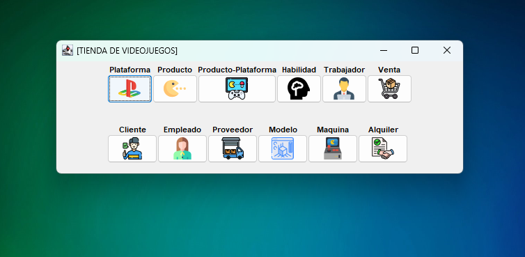
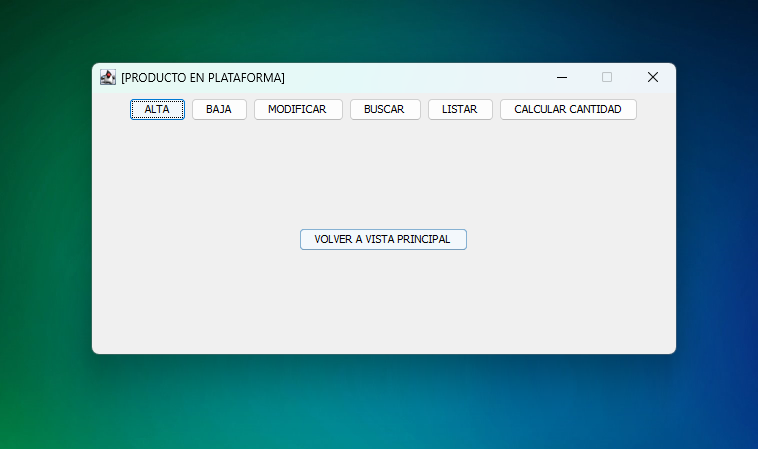
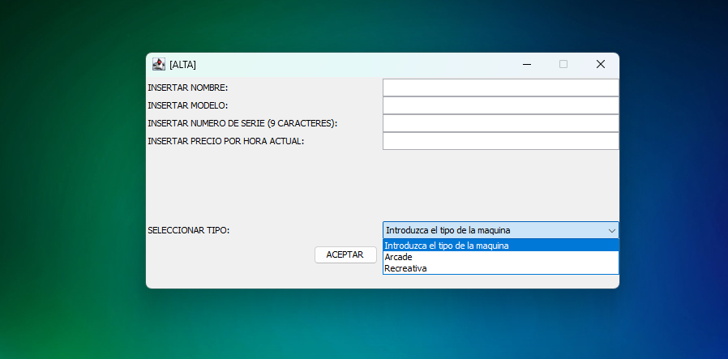
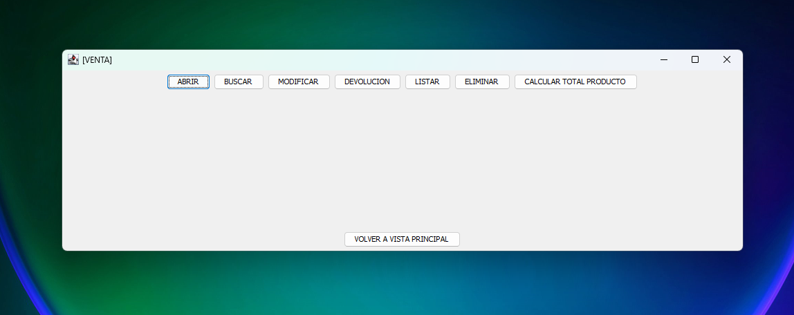
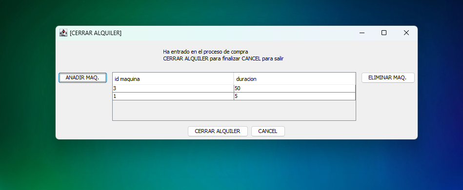
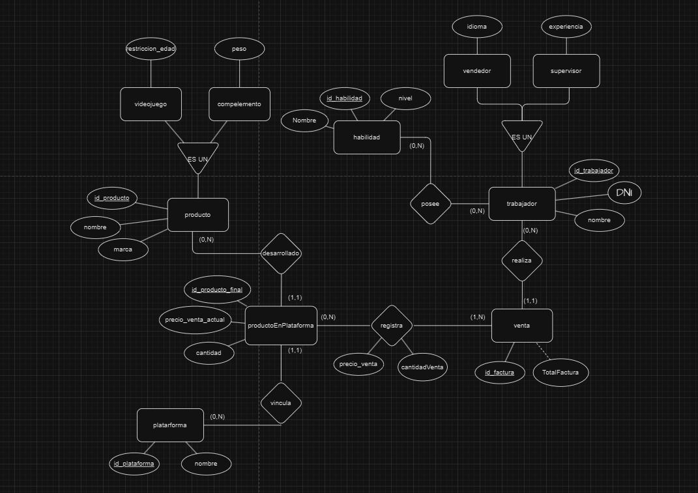
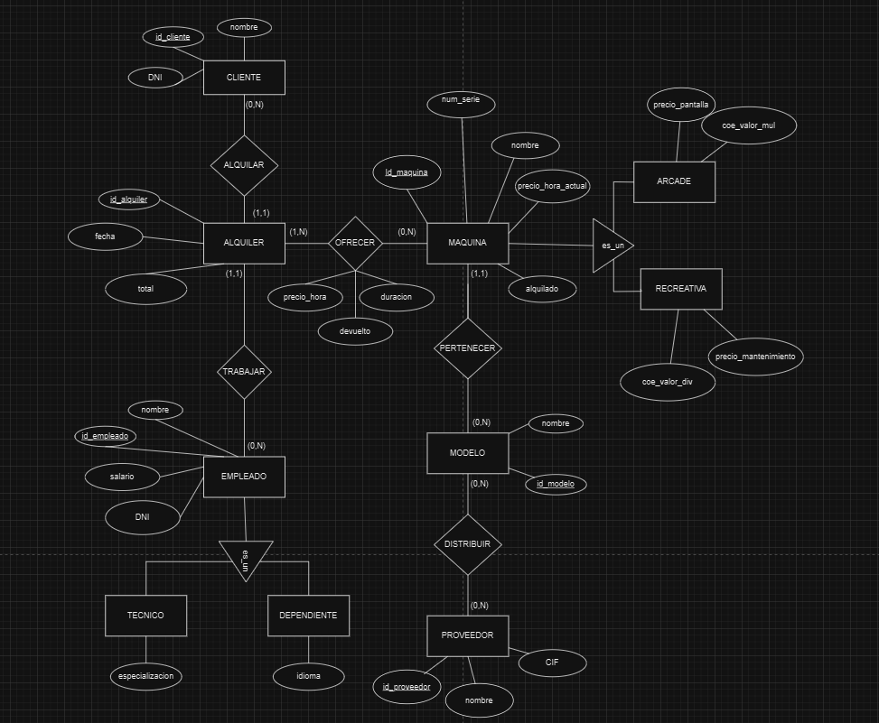

# Wei-Little 🎮  
**Sistema de Gestión de Tienda de Videojuegos y Sala Recreativa**

## 📌 Descripción  
Wei-Little es una aplicación de escritorio desarrollada en Java que simula la gestión de una tienda de videojuegos y un servicio de alquiler de máquinas recreativas.

Este proyecto académico se centró en aplicar prácticas completas de modelado y desarrollo de software, desde la planificación hasta el producto final, incluyendo:  
- Arquitectura de software (DAO, JPA, MVC)  
- Modelado con IBM RSAD (diagramas entidad-relación, de clases, casos de uso, actividades y secuencia)  
- Separación clara por capas: presentación, negocio e integración

---

## 🧠 Funcionalidades  
- Gestión de plataformas, productos, clientes y empleados  
- Registro de ventas, alquileres y devoluciones  
- Sistema de alquiler de máquinas arcade  
- Asociación entre productos y plataformas  
- Integración de JPA y DAO  
- Interfaz gráfica con Java Swing personalizada

---

## 🛠️ Tecnologías utilizadas  
- **Java**  
- **Java Swing**  
- **JPA**  
- **Arquitectura DAO**  
- **MySQL**  
- **Eclipse IDE**  
- **IBM Rational Software Architect Designer (RSAD)**

---

## 👥 Equipo  
Este proyecto fue desarrollado por un equipo de **12 devs**.  
**Alex Bonilla** actuó como **líder del equipo y desarrollador principal**, encargándose de la comunicación con el profesor, asignación de tareas, resolución de conflictos técnicos/personales y contribución activa al código.
- [Alex Guillermo Bonilla Taco](https://github.com/alexboni97): líder del equipo y desarrollador principal**, encargándose de la comunicación con el profesor, asignación de tareas, resolución de conflictos técnicos/personales y contribución activa al código.
- [Adrián Rodríguez Margallo](https://github.com/adrizz8)
- [Sergio Sánchez Carrasco](https://github.com/WalterDeRacagua) 
- [Santiago Ochoa de Zabalegui Velasco](https://github.com/SantiOch)
- [Weihong Zu](https://github.com/whz0) 
- [Airam Martin Soto](https://github.com/airamsoto)
- [Manuel Villa Abajo](https://github.com/Manuvi03) 
- [Jorge Calvo Fernandez](https://github.com/jorgecafe) 
- [Sergio Tarancón](https://github.com/sertaran) 
- [Alberto Moreno](https://github.com/albertomog88) 
- [Sergio Barbas](https://github.com/SerBarbas) 
- [Samuel Álvarez](https://github.com/samualvmed) 
---

## 📸 Capturas de pantalla  

---

## 🚀 Cómo ejecutar el proyecto en local  
1. Clonar el repositorio  
2. Importar el proyecto del codigo en Eclipse IDE  
3. Configurar la conexión con la base de datos MySQL con tu base de datos local
4. Ejecutar el proyecto localmente

---

## 📂 Estructura del proyecto  
- `presentacion/` – Vistas en Swing, controladores, factorías  
- `negocio/` – Servicios de aplicación, entidades, transfers, interfaces  
- `integracion/` – DAO, configuración JPA, factorías de consultas, `EMFSingleton`

---

## 📄 Licencia  
Este proyecto fue desarrollado con fines académicos y no está licenciado para uso comercial.
